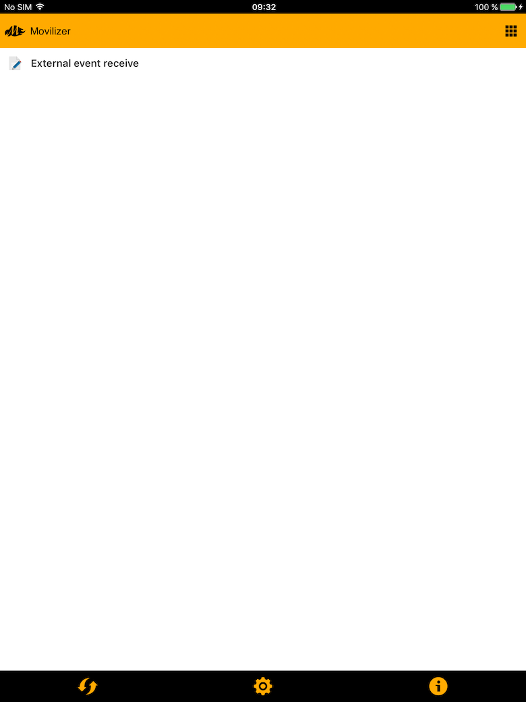
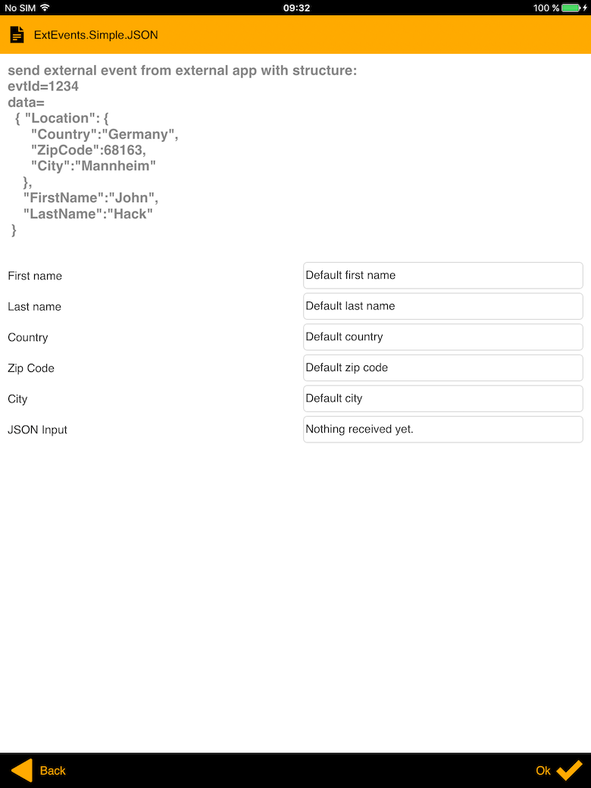
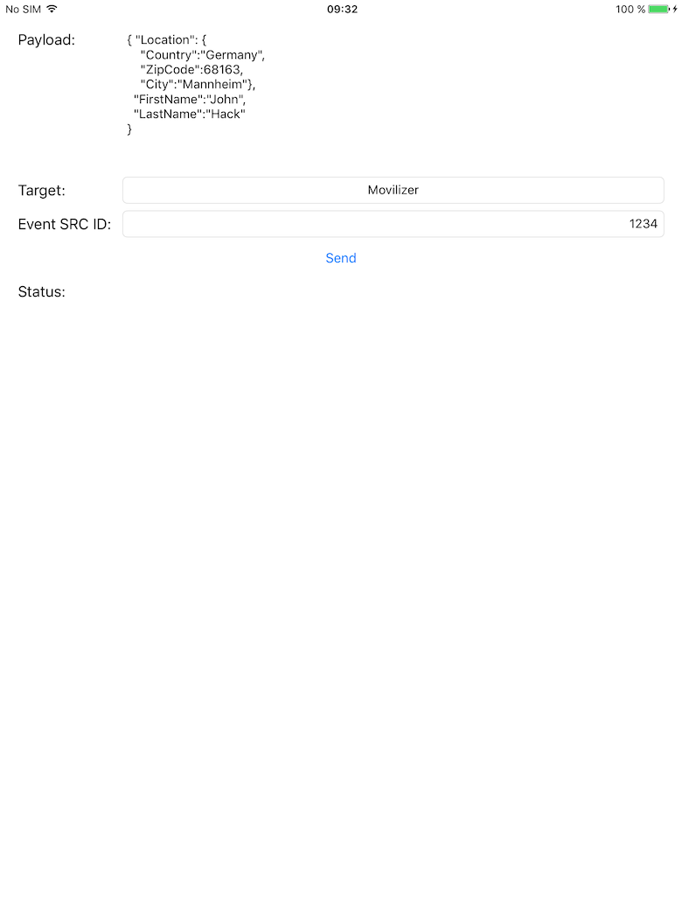
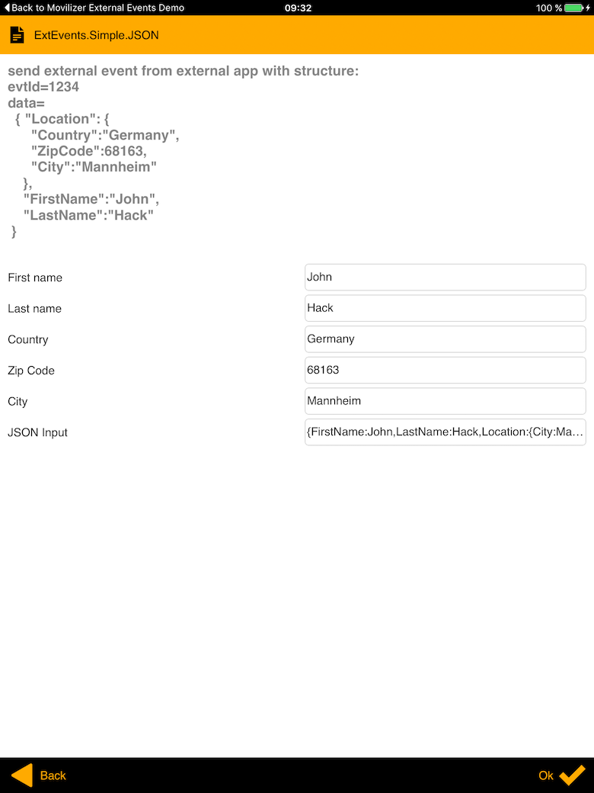

#  Movilizer External Events Demo application

## Concept

This is a demo application that triggers external events to Movilizer iOS application. This application code can be reused, when writing application that need integraiton with Movilizer Client. The overall idea is that within Movilizer Movelet, a MEL code can be registered to listen to external events, and when event occurs, can parse and process the input data. Within the Movilizer iOS Client, the events and data is received over schema URL calls. The limitations compared to other platforms is that there is no 2-way communication - when you openURL from your external application, that refers to registered URL of Movilizer Client, there is no reverse feedback if the event sending is successful.

## Requirements

You need a working account within Movilizer Demo or Productive Cloud. You will need to know your 
- System ID - for cloud backend request
- System password - for cloud backend request
- Participant Device ID - for client login
- Participant's password - for client login

Development environment:
- iOS 8+ Device/Simulator
- XCode6+ IDE

## Installation

-  On developer machine
  1. Open the DEMO project using XCode
  2. Launch the DEMO Project

-  On IOS device
  1. Download Movilizer Client from Apple store
  2. Start Movilizer Client and register in Demo system using your credentials
  3. Execute the following backend request, in order to create the test movelet that will receive external events

```xml
<MovilizerRequest requestTrackingKey="" systemId="YOUR_SYSTEM_ID" systemPassword="YOUR_SYSTEM_PASSWORD" 
	numResponses="1000" synchronousResponse="true" 
	useAutoAcknowledge="true" xmlns="http://movilitas.com/movilizer/v14">
	<moveletDelete moveletKey="external_event_1" moveletKeyExtension="${#Project#participantKey}" />
	<moveletSet>
		<movelet moveletKey="external_event_1" moveletKeyExtension="${#Project#participantKey}" 
				moveletType="MULTI" initialQuestionKey="Q3">
			<question key="Q3" title="ExtEvents.Simple.JSON" type="5">
	            <answer key="Q3A0" position="0" nextQuestionKey="END">
	                <text>First name</text>
	                <predefinedValue>Default first name</predefinedValue>
	            </answer>
	            <answer key="Q3A1" position="1" nextQuestionKey="END">
	                <text>Last name</text>
	                <predefinedValue>Default last name</predefinedValue>
	            </answer>
	            <answer key="Q3A2" position="2" nextQuestionKey="END">
	                <text>Country</text>
	                <predefinedValue>Default country</predefinedValue>
	            </answer>
	            <answer key="Q3A3" position="3" nextQuestionKey="END">
	                <text>Zip Code</text>
	                <predefinedValue>Default zip code</predefinedValue>
	            </answer>
	            <answer key="Q3A4" position="4" nextQuestionKey="END">
	                <text>City</text>
	                <predefinedValue>Default city</predefinedValue>
	            </answer>
	            <answer key="Q3A5" position="5" nextQuestionKey="END">
	                <text>JSON Input</text>
	                <predefinedValue>Nothing received yet.</predefinedValue>
	            </answer>
	            <text>send external event from external app with structure: 
evtId=1234 
data=
  { "Location": { 
      "Country":"Germany",
      "ZipCode":68163, 
      "City":"Mannheim"
    },
    "FirstName":"John",
    "LastName":"Hack"
 } 
	            </text>
	            <onEnterAssignment>
	                subscribeExternalEventId(1234);
	            </onEnterAssignment>
	            <onExternalEvent>
	                function($ref:evtSrc, $ref:data)
	                {
	                	setAnswerValue($answer:"Q3A0", data["FirstName"]);
	                    setAnswerValue($answer:"Q3A1", data["LastName"]);
	                    setAnswerValue($answer:"Q3A2", data["Location"]["Country"]);
	                    setAnswerValue($answer:"Q3A3", data["Location"]["ZipCode"]);
	                    setAnswerValue($answer:"Q3A4", data["Location"]["City"]);
	                    setAnswerValue($answer:"Q3A5", printArray(data, '{', ':', ',', '}'));
	                }
	            </onExternalEvent>
	            
	        </question>
			<name>External event receive</name>
		</movelet>
		<participant participantKey="YOUR_PARTICIPANT_KEY" name="YOUR_PARTICIPANT_NAME" deviceAddress="YOUR_PARTICIPANTS_DEVICE_ADDRESS"></participant>
	</moveletSet>
</MovilizerRequest>
``` 

The data that is passed from the demo app to Movilizer Client is formatted in a JSON string:
```js
{ 
	"Location": { 
		"Country":"Germany",
		"ZipCode":68163, 
      	"City":"Mannheim"
    },
    "FirstName":"John",
    "LastName":"Hack"
 }
```

## Testing external events

- Open registered Movilizer Client on iOS device

 

If you have sent the request to the cloud and registered successfuly on the client - you should have "External event receive" movelet in your main menu

- Open the movelet, that has a subscription and processing MEL code:

 

You should notice that the screen has some default values, that on external event will be populated with the data sent from DEMO app.

- Open the DEMO application and hit the "Send" button.

 

When the "Send" button is clicked for the first time, iOS will ask if you want to open movilizer. This should be confirmed, and then the active application should be Movilizer.

- Check the data in the Movilizer Movelet:

 

## Code walk-through

The overall logic can be found in ObjC Class [ViewController.m](Movilizer External Events Demo/ViewController.m).
The logic for calling Movilizer view schema:
```objc
- (IBAction)sendButtonClick:(UIButton *)sender {
	// Extract source ID
    NSString *eventSourceId = [self.eventSrcID text];
    // Extract the Payload
    NSString *json = [self.jsonPayloadTV text];
    // Compose the query string. Note that the eventType is only 0 - sync call
    NSString *encodedQueryString = [NSString stringWithFormat:@"?eventSourceId=%@&eventID=%d&eventType=0&json=%@",
                                    eventSourceId, _eventId++,
                                    [json stringByAddingPercentEncodingWithAllowedCharacters:[NSCharacterSet URLQueryAllowedCharacterSet]]];
    // Compose the call URL using the schema for chosen client (Demo or Pro) and the query String
    NSString *urlStr = [NSString stringWithFormat:@"%@%@",
                     [_endpointUrls objectForKey:[NSNumber numberWithInt:(int)_selectedEndpoint]],
                     encodedQueryString];
    NSURL *url = [NSURL URLWithString:urlStr];
    // In case of IOS9 - directly call the URL.
    if ([[UIDevice currentDevice].systemVersion intValue] >= 9) {
        // Directly open the url
        [[UIApplication sharedApplication] openURL:url];
    } else {
        // IOS 8 and bellow
        if ([[UIApplication sharedApplication] canOpenURL:url]) {
        	// Open movilizer with parameters for external event
            [[UIApplication sharedApplication] openURL:url];
        } else {
            [self.statusMessageTV setText:@"Cannot open Movilizer. Please check if it is installed"];
        }
    }
    
}
```

Here should be noted that if you target IOS9+ application, there is a restriction for calling `canOpenURL`. In order to be able to call it - you need to register the Movilizer schema URLs (in your application Info.plist). The following example registers Demo and Pro clients from the Apple store. In case you are running a customer client, you should consult Movilizer Support - for the correct schemas that are used. 

```plist
<key>LSApplicationQueriesSchemes</key>
<array>
	<string>movi-ev-sb</string>
	<string>movi-ev-pro</string>
</array>
```
